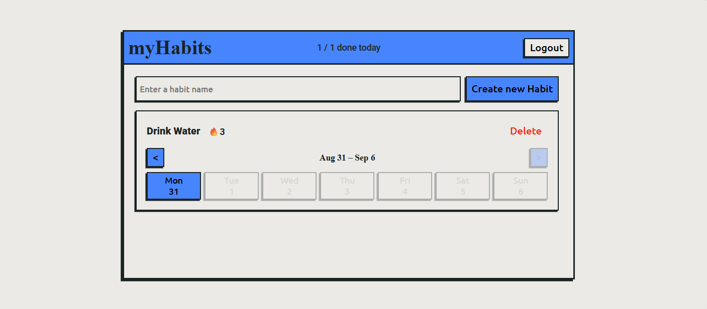
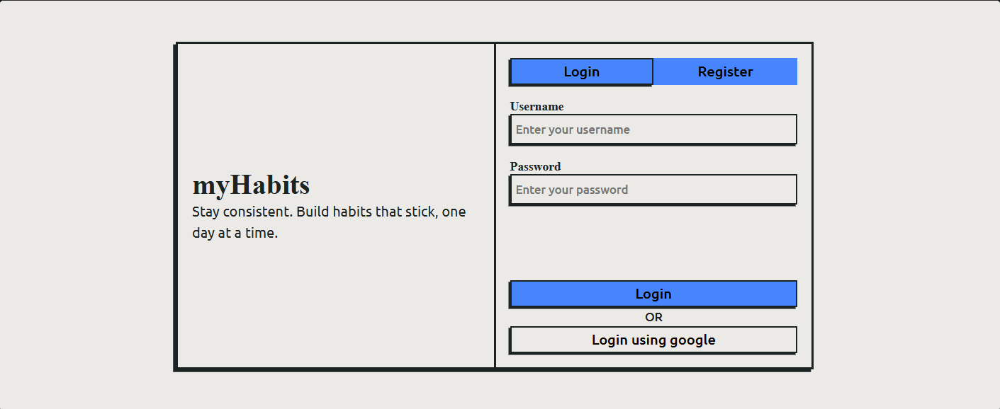
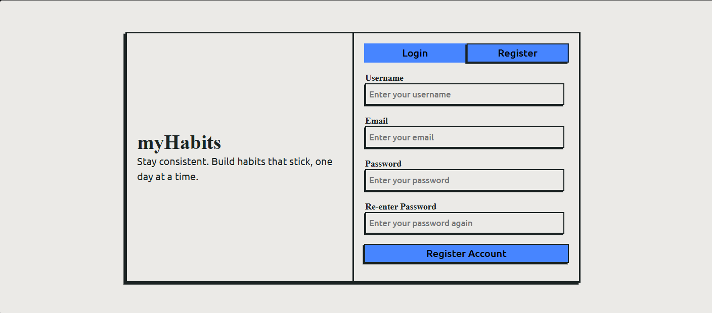

# myHabits

A full-stack habit tracking web app that helps build consistency by visualizing your habits week by week.

**[🌐 Live Website](https://habit-tracker-pglm.onrender.com)**

## Demo

[▶️ Watch the Demo](https://drive.google.com/file/d/1p62z7bHLUtvJOI_SBGVtrLmfJP03IymG/view?usp=sharing)

## What it does

myHabits lets you create habits and track them on a weekly grid. Each habit card shows the current week (Monday–Sunday) with a toggle per day to mark completion, a streak counter once you've hit 2+ consecutive days, and previous/next arrows to navigate to past weeks and review your history. The app also gives you a daily summary showing whether you've completed all your habits for the day. Accounts are secured with email/password registration (verified via a one-time email code) or Google sign-in.

## Screenshots

### Dashboard

### Login

### Registration

## Tech Stack

### Backend

* **C#:** ASP.NET Core, Entity Framework Core
* **Authentication:** JWT, Google OAuth
* **Email Verification:** One-time password (OTP) verification

### Frontend

* **React + TypeScript**
* **Routing:** React Router
* **UI:** Custom hand-drawn / neubrutalist components
